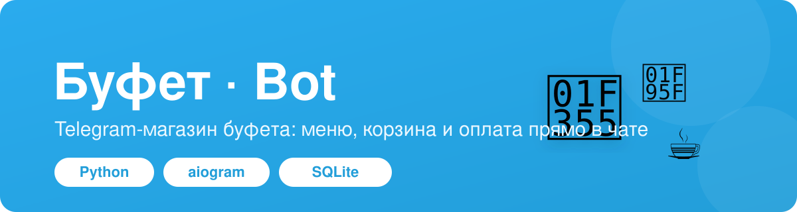
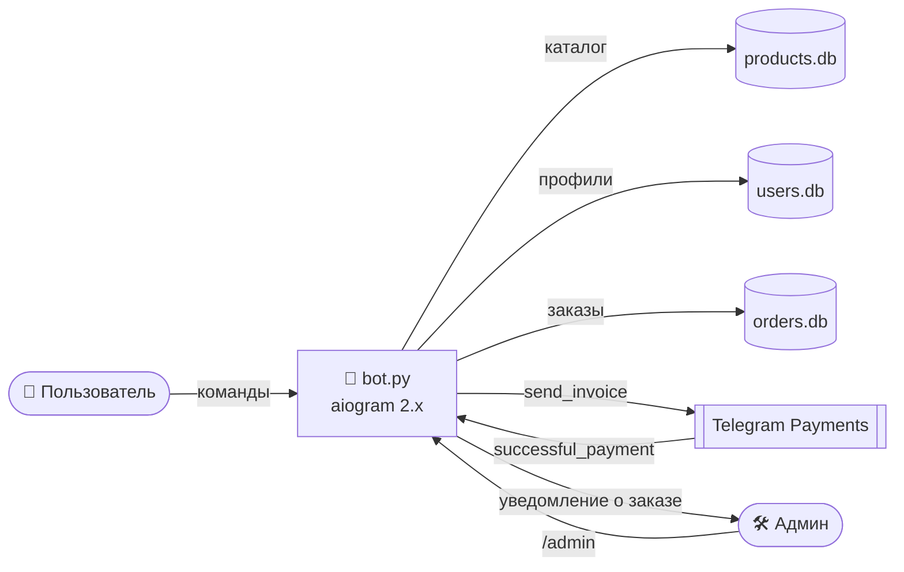

<p align="center">
  
</p>

<h1 align="center">🍽️ Буфет — Telegram-бот магазина</h1>

<p align="center">
  Готовый Telegram-бот для буфета/столовой: каталог блюд с фото, корзина,
  онлайн-оплата прямо в чате и панель администратора для управления заказами.
</p>

<p align="center">
  
  
  
  
</p>

---

## ✨ Возможности

- 🛒 **Каталог и корзина** — 15+ позиций с фотографиями, описанием, ценой и остатком на складе.
- 💳 **Оплата в Telegram** — приём платежей через Telegram Payments (`send_invoice`), поддержка оплаты как отдельного товара, так и всей корзины.
- 👤 **Регистрация пользователей** — пошаговый ввод ФИО через FSM, профиль по команде `/profile`.
- 📦 **Жизненный цикл заказа** — заказ сохраняется в БД, уведомление уходит администратору, статусы «отправлен админу» и «получен клиентом».
- 🛠️ **Админ-панель** — изменение остатков товаров и подтверждение выдачи заказа кнопками прямо в чате.
- 🗄️ **Хранение данных** — три базы SQLite: товары, пользователи, заказы.

---

## 🖼️ Как это выглядит

Меню бота — инлайн-кнопки с блюдами, при выборе приходит карточка-инвойс с фото и кнопкой оплаты:

| Команда | Что делает |
|---|---|
| `/start` | Регистрация нового пользователя |
| `/menu` | Показать меню буфета |
| `/cart` | Корзина и оплата |
| `/profile` | Данные пользователя |
| `/admin` | Режим администратора (только для `ADMIN_ID`) |
| `/help` | Список команд |

> 💡 Хотите живые скриншоты в README? Положите PNG в `assets/screenshots/` и вставьте их сюда.

---

## 🍕 Демо-меню

Каталог, которым бот наполняется скриптом `db.py`:

| Блюдо | Цена | Блюдо | Цена |
|---|---:|---|---:|
| Пикник | 64 ₽ | Пельмени | 140 ₽ |
| Беляш | 50 ₽ | Клаб-сэндвич | 110 ₽ |
| Пицца Маргарита | 150 ₽ | Наггетсы | 130 ₽ |
| Чебурек | 80 ₽ | Пончик | 50 ₽ |
| Сосиска в тесте | 70 ₽ | Кофе | 120 ₽ |
| Хачапури | 180 ₽ | Чай | 50 ₽ |
| Борщ | 120 ₽ | Компот | 60 ₽ |
| Плов | 160 ₽ | | |

---

## 🏗️ Архитектура



Поток покупки: пользователь выбирает товар → бот выставляет инвойс → Telegram обрабатывает
оплату → бот фиксирует заказ в `orders.db` и уведомляет администратора → админ подтверждает выдачу.

---

## 🚀 Быстрый старт

> Рекомендуемая версия — **Python 3.10 или 3.11** (aiogram 2.x использует старый `aiohttp`, который не собирается на Python 3.12+).

```bash
# 1. Клонировать репозиторий
git clone <repo-url> buffet && cd buffet

# 2. Виртуальное окружение и зависимости
python3 -m venv .venv
source .venv/bin/activate
pip install -r requirements.txt

# 3. Настроить секреты
cp .env.example .env
#   и вписать в .env свои BOT_TOKEN / PAYMENT_TOKEN / ADMIN_ID

# 4. Инициализировать базы данных
python db.py          # каталог товаров
python db_users.py    # таблица пользователей
python db_orders.py   # таблица заказов

# 5. Запустить бота
python bot.py
```

Где взять значения для `.env`:

| Переменная | Откуда |
|---|---|
| `BOT_TOKEN` | [@BotFather](https://t.me/BotFather) → `/newbot` |
| `PAYMENT_TOKEN` | @BotFather → бот → *Payments* (для теста подойдёт токен ЮKassa **TEST**) |
| `ADMIN_ID` | ваш Telegram user id ([@userinfobot](https://t.me/userinfobot)) |

---

## ⚙️ Запуск как сервис (systemd)

В комплекте есть юнит [`buffet.service`](buffet.service):

```bash
sudo cp buffet.service /etc/systemd/system/
sudo systemctl daemon-reload
sudo systemctl enable --now buffet
sudo systemctl status buffet
```

---

## 📁 Структура проекта

```
buffet/
├── bot.py            # весь бот: хендлеры, FSM, оплата, админка
├── config.py         # загрузка секретов из окружения (.env)
├── db.py             # схема + наполнение каталога товаров
├── db_users.py       # схема таблицы пользователей
├── db_orders.py      # схема таблицы заказов
├── buffet.service    # systemd-юнит для деплоя
├── requirements.txt
├── .env.example      # шаблон переменных окружения
└── assets/           # баннер и (опционально) скриншоты
```

---

## 🔐 Безопасность

- Секреты (`BOT_TOKEN`, `PAYMENT_TOKEN`, `ADMIN_ID`) хранятся **только в `.env`** и не попадают в репозиторий (см. `.gitignore`).
- Файлы баз `*.db` также исключены из git — данные пользователей не публикуются.
- Никогда не коммитьте реальный токен. Если токен где-то засветился — перевыпустите его через @BotFather.

---

## 🧰 Технологии

**Python · aiogram 2.x · SQLite · Telegram Bot API · Telegram Payments · systemd**

---

## 📄 Лицензия

[MIT](LICENSE)
